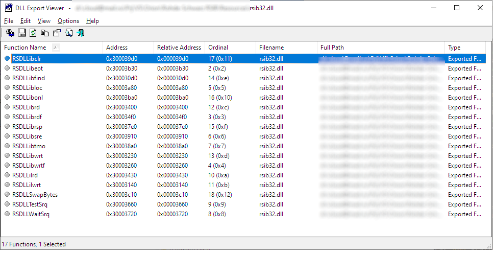

# Rohde-Schwarz-RSIB

VB.NET wrapper class in OOP paradigm for *Rohde&amp;Schwarz* RSIB interface. 

## Prerequisites

Wrapper uses R&S `rsib32.dll` library, that's attached to repo.

## RSIB exported functions list

See the screenshot below:

## Links

Detailed description of the exported DLL's functions is presented in R&S documentation (e.g. [FSQ_OpMa_en_02](https://cdn.rohde-schwarz.com/pws/dl_downloads/dl_common_library/dl_manuals/gb_1/f/fsq_1/FSQ_OpMa_en_02.pdf)).

